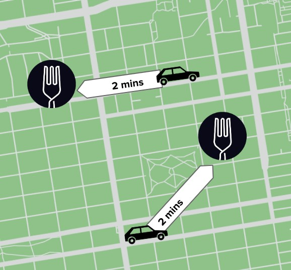

# 🚗 Uber Price Prediction Project 📊

Welcome to the Uber Price Prediction project! This project was build for learning and exploration, to build a predictive model for Uber fares using machine learning techniques. Whether you're a beginner in data science or a seasoned practitioner, this project will guide you through the process of developing a predictive model from start to finish. 🎓🤖

## Project Journey 🌟

Throughout this project, I aimed to:

- **Explore Real-World Data:** I delved into real-world ride data to uncover patterns and insights. This hands-on experience helped me understand the factors influencing Uber fares. 📈🔍

- **Transform Raw Data:** Feature engineering played a key role. I learned how to create meaningful features from raw data, including time-based calculations and distance metrics. 🛠️🔢

- **Experiment with Models:** I experimented with machine learning models, such as Linear Regression and Random Forest. This allowed me to gain practical experience and see how different algorithms perform. 🤓🤖

- **Evaluate Model Performance:** I evaluated my models using industry-standard metrics like Mean Squared Error (MSE) and Root Mean Squared Error (RMSE). This step helped me assess the quality of my predictions. 📊📉

- **Interpret Model Results:** Understanding the importance of features and interpreting model results was a fascinating part of the journey. It helped me make data-driven decisions. 🧐🔍

## How to Get Started 🛠️

If you'd like to explore my project or follow a similar learning path:

1. **Clone the Repository:** Clone this repository to your local machine using `git clone`. This will give you access to all the project files and notebooks. 🧬

2. **Explore the Jupyter Notebooks:** Dive into the Jupyter notebooks I've created. Each notebook focuses on a specific aspect of the project, with explanations and code samples to guide you. 📓🔬

3. **Experiment:** Feel free to experiment with different model configurations, settings, and tweaks. 🚀🤖
